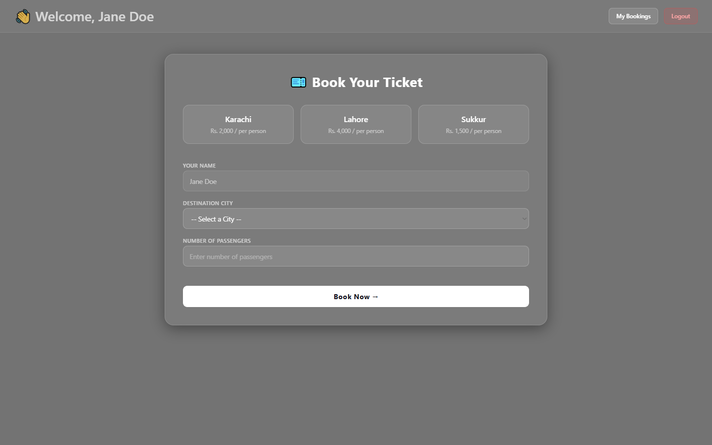
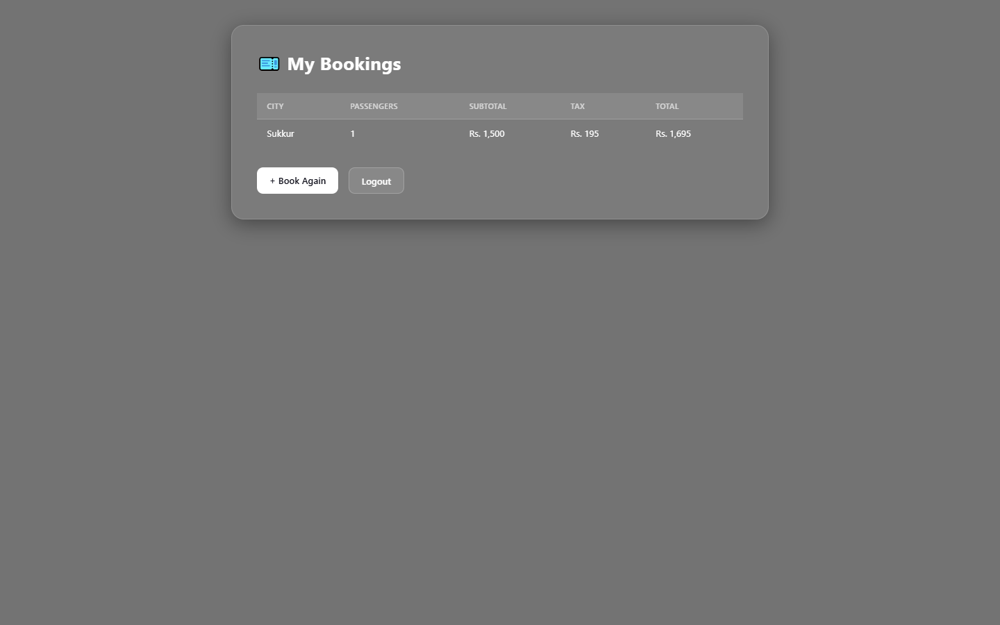

# 🚂 Train Ticket System


A simple web-based train ticket booking system built with **PHP** and **MySQL**. Users can register, log in, book train tickets to different cities, and view their previous bookings.

---

## 📸 Screenshots

| Dashboard (Book Ticket) | My Bookings |
|  |  |

## 🚀 Features

- User registration and login
- Book a train ticket to a destination city
- Automatic price calculation based on passenger age (half price for under 18)
- 13% tax applied to every booking
- View all previous bookings in one place
- Logout functionality

---

## 🗂️ Project Structure

```
/
├── config.php          # Database connection
├── index.php           # Welcome / landing page
├── register.php        # User registration
├── login.php           # User login
├── book.php            # Dashboard — book a ticket
├── summary.php         # Booking summary & receipt
├── mybookings.php      # View all previous bookings
└── logout.php          # Logout & destroy session
```

---

## 🗄️ Database

**Database name:** `ticketsystem`

| Table | Description |
|---|---|
| `users` | Stores registered users (name, email, password) |
| `bookings` | Stores ticket bookings (city, passengers, subtotal, tax, total) |

---

## 🏙️ Available Cities & Prices

| City | Price (per adult) | Price (under 18) |
|---|---|---|
| Karachi | Rs. 2,000 | Rs. 1,000 |
| Lahore | Rs. 4,000 | Rs. 2,000 |
| Sukkur | Rs. 1,500 | Rs. 750 |

> 13% tax is added on top of the subtotal.

---

## ⚙️ Setup

### 1. Requirements
- PHP 7.4+
- MySQL
- Apache / XAMPP / WAMP

### 2. Installation

```bash
# Clone the repository
git clone https://github.com/your-username/train-ticket-system.git

# Move to your server's root directory
# e.g. htdocs for XAMPP
```

## 🛠️ Built With

- **PHP** — Backend logic & session management
- **MySQL** — Database
- **HTML / CSS** — Frontend (Segoe UI, frosted glass UI)
- **No frameworks** — Pure vanilla PHP & CSS

---

## 📄 License

This project is open source and free to use for learning purposes.
